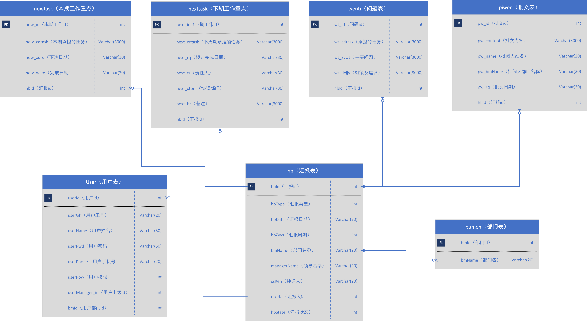

# work-report
企业老师的工作汇报系统作业，采用struts2完成的，我将数据库改用了MyBatis

# 工作汇报系统项目说明文档

作者：anselleeyy

> 项目版本为web3.1，基于Tomcat9 
> 项目数据库见mysql.sql  
> 运行项目时，先在数据库中运行mysql.sql，后修改项目src下的jdbc.properties中的url、username、password信息，项目即可运行

## 项目环境和部署说明

### 项目开发环境

- Windows 10_64
- Eclipse Oxygen.1a Release (4.7.1a)
- jdk 1.8.0_144
- MySQL 5.7.17-log
- Chrome 62.0.3202.89

### 项目框架

- struts2 2.5.13
- mybatis 3.4.5

## 数据库设计



## 项目完成内容

具体功能描述将在后面阐述

### 普通用户：

- 新建中的新建汇报功能( F1.1 )
- 待发中对汇报的发送、编辑（编辑后包括发送和保存）以及删除功能( F1.2 )
- 已发中的查看已发汇报的状态（包括汇报未批阅和已批阅）、对已批阅的汇报可以查看汇报内容和上级的批文或者删除该已批阅过的汇报( F1.3 )
- **以上三项内容周报、月报、年报均已实现并测试完成**
- 修改信息( F4.1 )

### 管理员用户：

- 新建( F1.1 )、待发( F1.2 )以及已发( F1.3 )中的功能同普通用户相同
- 周报、月报、年报中的收件箱可以查看管理员自己管理的下属发送过来未批阅过的所有汇报（包括本期以及以前的）( F2.1 )
- 修改信息( F4.1 )
- **员工管理**未完成( F4.3 )

### 超级管理员用户：

- 收件箱：超级管理员可以在收件箱中查看所有管理员发送过来未批阅过的周报、月报和年报( F2.2 )
- 修改信息( F4.1 )
- 部门管理未完成( F4.2 )
- **员工管理**未完成( F4.3 )

## 功能描述

### 工作汇报系统的基本功能( F1 )

以下功能描述均以周报为例，月报和年报同理

#### 普通用户及管理员对汇报的新建( F1.1 )

> 用户点击周报->新建后，后台检验用户本周是否有发送或保存过的周报，如有则显示：周报已发送或周报已保存；如没有则跳转 **zhoubao/xinjian.jsp**；  
> 新建页面中用户可以在**上周工作重点( pts )**中看到上周发送的汇报内容，同时，用户填写**本周主要工作总结( nowtask )**、**下周计划工作重点( nexttask )**和**存在的问题及合理化建议( wenti )**，用户经过填写后可以选择暂时**保存( F1.2 )**或**发送( F1.3 )**该份汇报；  
> 用户保存和发送的可以分别在待发和已发中看到

代码内容如下：

``` html
<!-- main/left.jsp -->
<a href="newhb?hb.ty=0" target="rightFrame" class="left-font03" onClick="tupian('1');">新建</a>
```

``` xml
<!-- struts.xml -->
<!-- 新建工作汇报 -->
<action name="newhb" class="com.ansel.action.HuiBaoAction" method="newHb">
    <result name="zb">zhoubao/xinjian.jsp</result>
    ……
</action>
```

#### 普通用户及管理员查看待发汇报( F1.2 )

> 用户点击周报->待发后，后台返回该用户所有待发的汇报( st==2 )于**zhoubao/daifalist.jsp**；如没有待发汇报则显示：目前还没有待发周报。  
> 待发汇报存在两种情况：1. 本周汇报可以**发送( F1.2.1 )**、**编辑( F1.2.2 )**、**删除( F1.2.3 )**；2. 非本期汇报显示**汇报过期**  

代码内容如下：

``` html
<!-- main/left.jsp -->
<a href="sendhb?hb.ty=0" target="rightFrame" class="left-font03" onClick="tupian('2');">待发</a>
```

``` xml
<!-- struts.xml -->
<!-- 查看待发汇报 -->
<action name="sendhb" class="com.ansel.action.HuiBaoAction" method="sendHb">
    <result name="zb">zhoubao/daifalist.jsp</result>
    ……
</action>
```

#### 待发汇报中的发送( F1.2.1 )

> 该功能出现在待发页面中的发送中  
> 用户在待发页面中点击发送，后台将会将汇报状态更新( st==2 -> st==1 )

代码内容如下：

``` html
<!-- zhoubao/daifalist.jsp -->
<a style="color: blue;text-decoration: underline;" href="<s:url action="sendsavedhb">
    <s:param name="hb.hbId" value="#info.id"></s:param>
    <s:param name="hb.hbType" value="#info.ty"></s:param>
</s:url>">发送</a>
```

``` xml
<!-- struts.xml>
<!-- 发送汇报 -->
<action name="sashb" class="com.ansel.action.HuiBaoAction" method="sasHb">
    <result name="zb">zhoubao/xinjian.jsp</result>
    ……
</action>
```

#### 待发汇报中的编辑( F1.2.2 )

> 该功能出现在待发页面中的编辑中  
> 用户点击相应汇报的编辑后，后台将该汇报的所有数据传到**zhoubao/daifa.jsp**中，并返回给用户  
> 用户可以在编辑中对原汇报内容进行增删改
> 编辑功能中，用户可以选择发送或保存编辑后的页面  
> 同新建功能一样，用户保存和发送的可以分别在待发和已发中看到

代码内容如下：

``` html
<!-- zhoubao/daifalist.jsp -->
<a style="color: blue;text-decoration: underline;" href="<s:url action="edithb">
    <s:param name="hb.hbId" value="#info.id"></s:param>
    <s:param name="hb.hbType" value="#info.ty"></s:param>
</s:url>">编辑</a>
```

``` xml
<!-- struts.xml>
<!-- 编辑待发汇报 -->
<action name="edithb" class="com.ansel.action.HuiBaoAction" method="editHb">
    <result name="zb">zhoubao/daifa.jsp</result>
    ……
</action>
```

#### 待发汇报中的删除( F1.2.3 )

> 该功能出现在待发页面中的删除中  
> 用户点击相应汇报的删除键，后台将会从数据库删除与该汇报有关的所有记录  
> 删除包括对当前待发汇报的删除和过期汇报的删除

代码内容如下：

``` html
<!-- zhoubao/daifalist.jsp -->
<a style="color: blue;text-decoration: underline;" href="<s:url action="deletehb">
    <s:param name="hb.hbId" value="#info.id"></s:param>
    <s:param name="hb.hbType" value="#info.ty"></s:param>
</s:url>">删除</a>
```

``` xml
<!-- struts.xml>
<!-- 删除待发汇报 -->
<action name="deletehb" class="com.ansel.action.HuiBaoAction" method="deleteHb">
    <result name="success" type="redirectAction">
        <param name="actionName">sendhb</param>
        <param name="hb.hbType">${hb.hbType}</param>
    </result>
</action>
```

#### 普通用户及管理员查看已发汇报( F1.3 )

> 用户点击周报->已发，后台返回该用户所有已发的汇报( st==1 || st==3 )于**zhoubao/yifalist.jsp**；如没有已发汇报则显示：目前还没有已发周报。  
> 已发汇报存在两种情况：1. 汇报未批阅( st==1 )；2. 已批阅( st==3 )  
> 用户可以对已批阅的汇报进行查看( F1.3.1 )和删除( F1.3.2 )

代码内容如下：

``` html
<!-- main/left.jsp -->
<a href="oldhb?hb.ty=0" target="rightFrame" class="left-font03" onClick="tupian('3');">已发</a>
```

``` xml
<!-- struts.xml -->
<!-- 查看已发汇报 -->
<action name="oldhb" class="com.ansel.action.HuiBaoAction" method="oldHb">
    <result name="zb">zhoubao/yifalist.jsp</result>
    ……
</action>
```

#### 已发汇报中的查看( F1.3.1 )

> 该功能出现在已发页面中的查看中，且仅当汇报被批阅过  
> 当用户点击查看后，后台返回该用户当前汇报的所有内容及批阅人的信息和批文内容于**zhoubao/yifa.jsp**

代码内容如下：

``` html
<!-- zhoubao/yifalist.jsp -->
<a style="color: blue;text-decoration: underline;" href="<s:url action="reviewhb">
    <s:param name="hb.hbId" value="#info.id"></s:param>
    <s:param name="hb.hbType" value="#info.ty"></s:param>
</s:url>">查看</a>
```

``` xml
<!-- struts.xml -->
<!-- 已发中查看批阅过的汇报 -->
<action name="reviewhb" class="com.ansel.action.HuiBaoAction" method="reviewHb">
    <result name="zb">zhoubao/yifa.jsp</result>
    ……
</action>
```

#### 已发汇报中的删除( F1.3.2 )

> 该功能出现有两处：1. 已发页面中的删除中，且仅当汇报被批阅过；2. 查看已发汇报中的删除
> 当用户点击删除后，后台将会从数据库删除与该汇报有关的所有记录

代码内容如下：

``` html
<!-- zhoubao/yifalist.jsp -->
<a style="color: blue;text-decoration: underline;" href="<s:url action="deleteoldhb">
    <s:param name="hb.hbId" value="#info.id"></s:param>
    <s:param name="hb.hbType" value="#info.ty"></s:param>
</s:url>">删除</a>
```

``` xml
<!-- struts.xml -->
<!-- 删除已发汇报 -->
<action name="deleteoldhb" class="com.ansel.action.HuiBaoAction" method="deleteHb">
    <result name="success" type="redirectAction">
        <param name="actionName">oldhb</param>
        <param name="hb.hbType">${hb.hbType}</param>
    </result>
</action>
```

### 工作汇报系统的收件箱功能( F2 )

#### 管理员的收件箱功能( F2.1 )

> 管理员点击周报->收件箱后，后台返回该管理员所管理的所有员工的未批阅的周报于**shoujianxianglist.jsp**；如没有未读汇报则显示为空  
> 管理员在收件箱中可以对相应汇报进行**批复( F3 )**操作
> 月报和年报的收件箱同上

代码内容如下：

``` html
<!-- main/left.jsp -->
<a href="normalget?hb.ty=0" target="rightFrame" class="left-font03" onClick="tupian('4');">收件箱</a>
```

``` xml
<!-- struts.xml -->
<!-- 进入管理员的收件箱系统 -->
<action name="normalget" class="com.ansel.action.HuiBaoAction" method="normalGet">
    <result name="success">shoujianxianglist.jsp</result>
</action>
```

#### 超级管理员的收件箱功能( F2.2 )

> 超级管理员点击收件箱后，后台返回所有管理员的所有未批阅的汇报于**managersjxlist.jsp**；如没有未读汇报则显示为空  
> 超级管理员在收件箱中可以对相应汇报进行**批复( F3 )**操作  
> 月报和年报的收件箱与周报在同一页面中

代码内容如下：

``` html
<!-- main/left.jsp -->
<a href="superget?hb.ty=0" target="rightFrame" class="left-font03" onClick="tupian('4');">收件箱</a>
```

``` xml
<!-- struts.xml -->
<!-- 进入超级管理员的收件箱系统 -->
<action name="superget" class="com.ansel.action.HuiBaoAction" method="superGet">
    <result name="success">managersjxlist.jsp</result>
</action>
```

### 工作汇报系统的批复功能( F3 )

> 批复功能按钮出现在管理员和超级管理员的收件箱中，当用户点击此按钮后，会进入相应汇报内容页面，用户可以查看相应汇报的具体内容，并为此拟写批文  
> 批复页面中有两个功能：1. 返回( F3.1 )；2. 批阅( F3.2 )

代码内容如下：

``` html
<!-- shoujianxianglist.jsp || managersjxlist.jsp -->
<a href="
    <s:url action="pfhb"><s:param name="hb.hbId" value="#info.id"></s:param></s:url>">
    <input type="button" class="inpu1" value='批复'/>
</a>
```

``` xml
<!-- struts.xml -->
<!-- 批复汇报 -->
<action name="pfhb" class="com.ansel.action.HuiBaoAction" method="pfHb">
    <result name="zb">zhoubao/showzhoubao.jsp</result>
    ……
</action>
```

#### 批复中的返回功能( F3.1 )

> 用户点击返回后，将返回收件箱页面

代码内容如下：管理员部分与超级管理员部分相似

``` html
<!-- zhoubao/showzhoubao.jsp -->
<a href="normalget?hb.ty=0">
    <input class="a" type="button" value="返&nbsp;&nbsp;&nbsp;&nbsp;回"/>
</a>
```

``` xml
<!-- struts.xml -->
<!-- 返回管理员的收件箱系统 -->
<action name="normalget" class="com.ansel.action.HuiBaoAction" method="normalGet">
    <result name="success">shoujianxianglist.jsp</result>
</action>
```

#### 批复中的批阅功能( F3.2 )

> 用户点击批阅后，后台将会将汇报从已发送状态( st== 1 )置为已批阅( st == 3 )  
> 后台将会将批文内容存入数据库  
> 此时该汇报的发件人的已发中，该汇报状态将显示***已批阅***，且可以查看汇报的内容和批文（即功能 F1.3.1）

代码内容如下：**管理员部分**

``` html
<!-- zhoubao/showzhoubao.jsp -->
<input class="a" type="button" value="批&nbsp;&nbsp;&nbsp;&nbsp;阅" onclick="upload('$(hbu.id)')" />
```

``` javascript
// zhoubao/showzhoubao.jsp
function upload(param) {
    var b = "uploadpf?hb.ty=0&hb.id=" + param;
    document.form1.action = b;
    document.form1.submit();
}
```

``` xml
<!-- struts.xml>
<!-- 管理员的批复 -->
<action name="uploadpf" class="com.ansel.action.HuiBaoAction" method="uploadPf">
    <result name="zb" type="redirectAction">
        <param name="actionName">normalget?hb.ty=0</param>
    </result>
    ……
</action>
```

代码内容如下：**超级管理员部分**

``` html
<!-- zhoubao/showzhoubao.jsp -->
<input class="a" type="button" value="批&nbsp;&nbsp;&nbsp;&nbsp;阅" onclick="suupload('$(hbu.id)')" />
```

``` javascript
// zhoubao/showzhoubao.jsp
function suupload(param) {
    var b = "uploadsuperpf?hb.id=" + param;
    document.form1.action = b;
    document.form1.submit();
}
```

``` xml
<!-- struts.xml>
<!-- 超级管理员的批复 -->
<action name="uploadsuperpf" class="com.ansel.action.HuiBaoAction" method="uploadPf">
    <result name="*" type="redirectAction">
        <param name="actionName">superget</param>
    </result>
</action>
```

### 工作汇报中的管理功能( F4 )

#### 管理中的修改信息( F4.1 )

> 用户点击**修改信息**后，后台将返回该用户的手机号返回于**updateself.jsp**  
> 修改信息模块允许用户修改手机号( Eg.1 )或修改密码( Eg.2 )或2个都修改  
> 用户必须填写原密码以确认修改  
> 修改的手机号码必须格式正确

代码内容如下：

``` html
<!-- main/left.jsp -->
<a href="updateself" target="rightFrame" class="left-font03">修改信息</a>
```

``` xml
<!-- struts.xml -->
!-- 修改信息 -->
<action name="updateself" class="com.ansel.action.OperateAction" method="updateSelf">
    <result name="success">updateself.jsp</result>
</action>
```

> 如果原密码正确，则跳转 result: success; 否则 result: error

``` xml
<!-- struts.xml -->
<!-- 更新信息 -->
<action name="updateinfo" class="com.ansel.action.OperateAction" method="updateInfo">
    <result name="success">UpdateSuccess.jsp</result>
    <result name="error">UpdateError.jsp</result>
</action>
```

#### 管理中的部门管理( F4.2 )

> 该功能仅超级管理员拥有  
> 超级管理员点击**部门管理**, 后台将返回所有部门信息于**bumenlist.jsp**  
> 管理员可以在其中修改、增加或删除部门

进入部门管理页面代码内容如下：

``` html
<!-- main/left.jsp -->
<a href="managebumen" target="rightFrame" class="left-font03">部门管理</a>
```

``` xml
<!-- struts.xml -->
<!-- 进入部门管理 -->
<action name="managebumen" class="com.ansel.action.OperateAction" method="manageBumen">
    <result name="success">bumenlist.jsp</result>
</action>
```

> 修改部门名称

``` html
<!-- bumenlist.jsp -->
<input type="text" class="inpu1" value="修改" onclick="sub1()"/><br>
```

``` javascript
// bumenlist.jsp
function sub1() {
    if (likai1()) {
        document.form1.action = "updatebm";
        document.form1.submit();
    }
}
```

``` xml
<!-- struts.xml -->
<!-- 更新部门信息 -->
<action name="updatebm" class="com.ansel.action.OperateAction" method="updateBm">
    <result name="success">bumen/updatesuccess.jsp</result>
</action>
```

> 新增部门

``` html
<!-- bumenlist.jsp -->
<input type="text" class="inpu1" value="添加" onclick="sub2()" /><br>
```

``` javascript
// bumenlist.jsp
function sub2() {
    if (likai()) {
        document.form2.action = "addbumen";
        document.form2.submit();
    }
}
```

``` xml
<!-- struts.xml -->
<!-- 新增部门 -->
<action name="addbumen" class="com.ansel.action.OperateAction" method="addBumen">
    <result name="success">bumen/insertsuccess.jsp</result>
</action
```

> 删除部门

``` html
<!-- bumenlist.jsp -->
<a href="<s:url action="managebumen">
    <s:param name="bm.name" value="#info.name"></s:param>
    <s:param name="bm.id" value="#info.id"></s:param></s:url>">
    <input type="button" class="inpu1" value='修改'/>
</a>
```

``` xml
<!-- struts.xml -->
<!-- 删除部门 -->
<action name="deletebumen" class="com.ansel.action.OperateAction" method="deleteBumen">
    <result name="success">bumen/deletesuccess.jsp</result>
</action>
```

#### 管理中的员工管理( F4.3 )

该功能未实现

## 备注

- 上述功能中实现的功能均经过测试且无误
- 该项目存在两个问题：1. 如果周报的周期为1，后台查找会查到周期为0处，该问题并未修正；2. 如果项目周期在数据库中存在多个（即：2016年的51周和2017年的51周），则会出现问题，该问题并未修正

